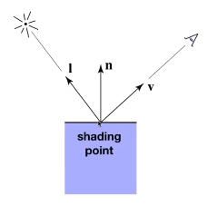
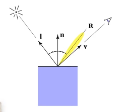
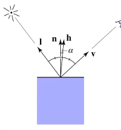
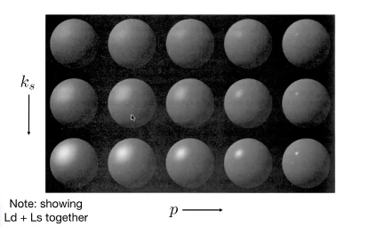
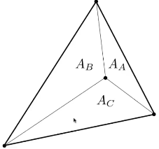
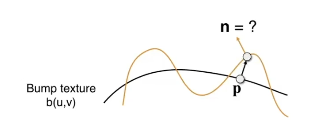

# GAMES101-现代图形学入门笔记7-9：着色、纹理

该课程是 GAMES 开设的现代计算机图形学课程，系统而全面的介绍：光栅化、几何表示、光的传播理论、动画与模拟。每个方面都从基础原理出发讲解到实际应用，并介绍前沿的理论研究。本文是其 7、8、9 章着色和纹理的学习笔记。

<!--katex-->

## 1. 着色

### 着色定义

绘画着色定义：The darkening or coloring of an illustration or diagram with parallel lines or a block of color。

本课程的定义：对不同物体应用不同材质的操作（The process of applying a material to an object）。

### 简单的着色模型

知觉观察：

- 高光（Specular highlights）
- 漫反射（Diffuse reflection）
- 间接光照（Ambient lighting）

### 局部着色

假设：假设着色发生在着色点，在着色点附近的极小区域可以视为平面。



输入，方向都设为单位向量：

- 观察者方向 $\vec{v}$
- 表面法线 $\vec{n}$
- 光线方向 $\vec{l}$，对于很多不同的光线
- 表面参数：
    - 颜色
    - 光泽度
    - ……

考虑任何点的着色都只看自身，而不看其它物体的存在 —— 并不生成阴影。

### 漫反射（Diffuse Reflection）

#### 光线接受

光线被均匀地反射（scattered）反射到所有方向上去。

表面朝向、光线角度和最终效果有关，接受到的光线与入射光线和法线夹角正比 —— 兰伯特余弦定则：

$$
l_{received} = \vec{l} \cdot \vec{n}
\tag {1}
$$

#### 能量衰减

能量衰减：理想空间中均匀传递出的球壳能量完全相同，因此有：

$$
I_f \cdot \pi d_f^2= I_n \cdot \pi d_n^2
\tag {2}
$$

#### Lambertian（Diffuse）Shading

反射独立于视角方向。

$$
L_d = k_d\frac{I}{r^2}\max(0, \vec{n}\cdot\vec{l})
\tag{3}
$$

其中，$L_d$ 是漫反射的光线；$k_d$ 是漫反射系数（该值与颜色相关）；$\frac{I}{r^2}$ 代表到达着色点的光线；$\max(0, \vec{n}\cdot\vec{l})$ 代表被着色点吸收的系数。

### 高光（Specular）

#### Blinn-Phong 高光项

高光项强度依赖于视角方向：接近镜面反射的方向。



观察：当 $\vec{v}$ 接近镜面反射方向的时候，说明了法线和半程向量接近 —— 通过点乘测量单位向量可以测量“接近”。

$$
\begin{aligned}
\vec{h} &= bisector(\vec{v}, \vec{l}) \\
        &= \frac{\vec{v} + \vec{l}}{||\vec{v} + \vec{l}||}
\end{aligned}
\tag{4}
$$

其中，$\vec{h}$ 表示半程向量。则高光可以通过以下公式计算：



$$
\begin{aligned}
L_s &= k_s\frac{I}{r^2}\max(0, \cos{\alpha})^p \\
    &= k_s\frac{I}{r^2}\max(0, \vec{n}\cdot\vec{h})^p
\end{aligned}
\tag{5}
$$

其中：$k_s$ 代表光泽度；$p$ 项用来减小高光的范围（易想到高光只出现在极小的范围），一般用 100-200 的系数。



### 间接光照（Ambient）

环境光着色并不依赖任何其他：

- 添加常数颜色来保证没有地方是黑的并提升一个亮度
- 环境光与实际的直接光照没有关系
- 与观测方向无关
- 这是一个及其大胆的非真实假设，想要真正地计算它，需要全局光照

$$
L_a = k_a L_a
\tag{6}
$$

### Blinn-Phong 反射模型 

Blinn-Phong Reflection = Ambient + Diffuse + Specular

$$
\begin{aligned}
L &= L_a + L_d + L_s \\
  &= k_a I_a + k_d\frac{I}{r^2}\max(0, \vec{n}\cdot\vec{l}) + k_s\frac{I}{r^2}\max(0, \vec{n}\cdot\vec{h})^p
\end {aligned}
\tag{7}
$$

### 着色频率

三种直观的着色频率：

1. 面着色
2. 顶点着色：三角形内部进行差值
3. 像素着色

当几何相对复杂的情况下（比如面特别多），简单的着色频率效果不一定差，成本不一定低。

#### 平面着色（flat shading）

平面着色：着色每个三角形

- 三角形的面是一个平面，拥有一个法向量
- 对于平滑表面效果不好

#### 顶点着色（Gouraud shading）

顶点着色：

- 每个顶点进行着色，三角形内部对顶点颜色进行插值
- 每个顶点拥有一个法线

#### 像素着色（Phong Shading）

像素着色：

- 对三角形的三个顶点求出各自的法线，对内部的每个像素插值出其法线
- 对每个像素计算一次全着色模型
- 不是 Blinn-Phong 反射模型

### 顶点法线和像素法线

#### 顶点法线

观察：任何一个顶点都和很多个面相关联。

方法：

1. 使用相邻的法线求平均
2. 使用相邻的三角形的法线和其面积求加权平均

#### 像素法线

见后续中心坐标部分

## 2. 管线

### 管线流程

图形管线：本课程指实时渲染管线。

如何从应用到显示：

```mermaid
graph TD;
    A["Application"] --Input--> B("Vertex Processing")
    B --Vertex Stream--> C("Triangle Processing")
    C --Triangle Stream--> D("Rasterization")
    D --Fragment Stream--> E("Fragment Processing")
    E --Shaded Fragments--> F("FrameBuffer Operations")
    F --Output--> G["Display"]
```

- Input: vertices in 3D space
- Vertex Stream: Vertices positioned in screen space
- Triangle Stream: Triangles positioned in screen space
- Fragment Stream: Fragments, on per covered sample
- Shaded Fragments
- Output: Image (pixels)

### 着色器简介

- 编程顶点和片段处理步骤
- 描述对于单个顶点和片段的操作

示例 `GLSL` 片段着色器程序如下：

```glsl
uniform sampler2D myTexture;
uniform vec3 lightDir;
varying vec2 uv;
varying vec3 norm;

void diffuseShader() {
    vec3 kd;
    kd = texture2D(myTexture, uv);
    kd *= clamp(dot(-lightDir, norm), 0.0, 1.0);
    gl_FragColor = vec4(kd, 1.0);
}
```
上述着色器：

- 着色器函数对于每个片段执行
- 输出当前片段的银幕采样位置的表面颜色

推荐网站：

[shadertoy](https://www.shadertoy.com)

### 拓展

- 通过 shader 可以实现相当多复杂的功能
- 游戏引擎集成了相当多的现成工具
- 越来越多的着色器：
    - 几何 shader：动态产生三角形
    - 计算 shader：可以完成复杂的计算，GPGPU
- GPU 并行度非常高

## 3. 纹理映射和进阶

### 纹理映射

#### 目的

希望有一种方法能够定义物体的任何一个点上的属性。

#### 方法和定义 

- 任何一个物体的表面都是 2D 的
- 对于多个物体可以分成多张图：拉伸、压缩、包围、分割

#### 纹理上的坐标

每个三角形顶点能够被赋予一个顶点坐标：$(u,v)$：

- 为方便处理，认为 $u$、$v$ 的范围都在 $[0,1]$
- 不同位置的纹理可以映射到同一个位置
- 纹理设计时要考虑重复的衔接问题，这种设计称为 tilable

### 重心坐标（Barycentric Coordinates）

重心坐标：三角形插值

#### 三角形插值

为何在三角形中插值？

- 在三角形中获得平滑变化的值
- 指明顶点的值

插值的内容？

- 材质轴、颜色、法线向量等

如何插值：

- 重心坐标

#### 重心坐标

重心坐标是定义在三角形上的坐标系系统 $(\alpha, \beta, \gamma)$

$$
\begin{aligned}
(x, y) = &\alpha A + \beta B + \gamma C \\
         &\alpha + \beta + \gamma  = 1
\end{aligned}
\tag{8}
$$

三角形内的任何一个点都可以使用三个顶点的线性组合即可，需满足系数之和为 1。

实际上由于这种限制，只需要两个值就可以表示。三个值都需要非负，才能表示该值位于三角形内部。



$$
\begin{aligned}
\alpha &= \frac{A_A}{A_A + A_B + A_C} \\
\beta &= \frac{A_B}{A_A + A_B + A_C} \\
\gamma &= \frac{A_C}{A_A + A_B + A_C}
\end{aligned}
\tag{9}
$$

通过以上方法，可得三角形重心为：

$$
\begin{aligned}
(\alpha, \beta, \gamma) &= (\frac{1}{3}, \frac{1}{3},\frac{1}{3}) \\
(x, y) &= \frac{1}{3} A + \frac{1}{3} B + \frac{1}{3} C
\end{aligned}
\tag{10}
$$

通用的坐标向重心坐标的转换得：

$$
\begin{aligned}
\alpha &= \frac{-(x-x_B)(y_C-y_B) + (y-y_B)(x_C-X_B)}{-(x_A - x_B)(y_C - y_B) + (y_A - y_B)(x_C - x_B)} \\
\beta &= \frac{-(x-x_C)(y_A-y_C) + (y-y_C)(x_A-X_C)}{-(x_B - x_C)(y_A - y_C) + (y_B - y_C)(x_A - x_C)} \\
\gamma &= 1 - \alpha - \beta
\end{aligned}
\tag{11}
$$

可以使用重心坐标来做三角形内部属性的插值，插值的属性同样应该使用中心坐标来线性的组合出来：

$$
V = \alpha V_A + \beta V_B + \gamma V_C
\tag{12}
$$

**在投影变化下不能保证重心坐标不变**，因此在三维下取坐标应该在三维坐标系中取，而不能在投影之后的结果中取。

### 纹理过滤

#### 简单纹理映射：散射颜色

伪代码如下：

```pseudo
for each rasterized screen sample (x,y):
    (u, v) = evaluate texture coordinate at (x,y);
    texcolor = texture.sample(u,v);
    set sample's color to texcolor;
```

其中，纹理坐标使用重心坐标，通常 `color` 指的是 diffuse albedo $k_d$。

#### 纹理放大 - 双线性插值

纹理放大（Texture Magnification）：如果纹理太小了？

- Neareast 邻近插值：Round(val)
- Bilinear 双线性插值：
    1. 获取邻近的四个点
    2. 获得离左下角的水平距离和竖直距离 $(s,t), s、t \in [0,1]$
    3. 定义线性插值：$lerp(x, v_0, v_1) = v_0 + x(v_1 - v_0)$
    4. 进行线性插值：
        - $u_0 = lerp(s, v_{00}, u_{10})$
        - $u_1 = lerp(s, u_{01}, u_{11})$
        - $f(x,y) = lerp(t, u_0, u_1)$
- Bicubic 双向三次插值：
    1. 取邻近 16 个点
    2. 4 个成组进行插值
    3. 4 组插值结果分别进行插值

PS：A pixel on a texture - a texel

好的质量往往伴随着更大开销

#### 纹理过大 - 三线性插值（Trilinear）

仍然是走样的问题。

简单的修正方法？MSAA：太慢

另一个思路：

- 采样会引起走样 => 不查询
- 点查询 => 范围查询

Mipmap：允许进行范围查询，快速、近似、方形，它可以从一张图生成更多的纹理（计算机视觉称为图像金字塔），占据的空间为 4/3。

计算 Mipmap 等级 D：

$$
\begin{aligned}
D &= \log_2{L} \\
L &= \max{ 
\left(
\sqrt{(\frac{du}{dx})^2 + (\frac{dv}{dx})^2} \cdot \sqrt{(\frac{du}{dy})^2 + (\frac{dv}{dy})^2} \right) }
\end{aligned}
\tag{13}
$$

思路是将右方和上方的点投影到材质上，计算近似距离；可以看做求微分。查询在第几层是 1 个像素的值。

不希望在不连续的层上查询，则可以进行对不同层上的结果进行插值 - 三线性插值。

#### Mipmap 局限性 - 各向异性过滤（Anisotropic）

远处过模糊？Mipmap 只能进行正方形过滤

Ripmaps 和 summed area 表：

- 可以查询矩形压缩
- 但是仍然不能解决斜向问题
- 总共的开销是原本的三倍
- nX 各项异性过滤代表压缩到多少倍，和显卡性能基本无关，基本只和显存有关

#### 其他过滤方法 - EWA

EWA 过滤：

- 有任意不规则形状，可以拆成很多圆形来覆盖区域，多次查询覆盖圆形
- 代价较高

### 更多纹理应用

#### 环境光映射

记录来自各个方向的光；若屋子较小，不能直接运用方向记录信息。

简单的方法：在场景中设置金属球，则金属球反射的信息即为环境光；可以记录在球面上然后展开

问题和解决：

- 问题：展开后会产生扭曲，不是均匀的展开
- 解决：将信息记录在立方体上，则有 6 张图

该方法称为天空盒 Cube Map

#### 法线贴图（Bump texture）

观察：

- 纹理可以记录相对高度和法线信息
- Bump/normal mapping
- 伪造细节几何

得到凹凸贴图（高度）和法线贴图（法线）：记录任何点高度相对的移动，通过高度的变化改变法线：



考虑 flatland，由斜率和法线的关系有：

$$
\begin{aligned}
dp &= c * [h(p+1) - h(p)] \\
n(p) &= (-dp, 1).norm()
\end{aligned}
\tag{14}
$$

对于更高维度的情况下：

$$
\begin{aligned}
dp/du &= c1 * [h(u+1) - h(u)] \\
dp/dv &= c2 * [h(v+1) - h(v)] \\
n &= (-dp/du, -dp/dv, 1).normalized()
\end{aligned}
\tag{15}
$$

以上假设法线为 $(0,0,1)$，可以认为在局部坐标系的法线就是指向局部坐标系的 $z$ 轴，然后再转换回原坐标系。

#### 位移贴图（Displacement mapping）

位移贴图是相对于法线贴图更高级的方法；法线贴图会在边缘处露馅且无法处理自身内部阴影的情况：

- 它真实地移动了顶点的位置
- 使用和法线贴图相同的纹理

要求和限制：

- 模型三角形足够细，采样率需要非常高
- 可以先定义较低细分程度的面，在需要的时候结合位移贴图检测是否需要进行细分 —— 动态曲面细分

#### 3D Procedural Noise + Solid Modeling

定义在三维空间中噪声的函数，该噪声函数可以来算出性质，常见的方法为柏林噪声 - Perlin Noise

#### 提供预计算着色（Provide Precomputed Shading）

想要实时计算模型内部复杂阴影，可以使用环境光遮蔽，但是成本代价较高。可以计算好后写入贴图。

#### 3D 纹理和体渲染

物体的信息记录在空间中，但是作为纹理