# 1. 引言

类型系统的根本目的是为了防范在程序运行过程中执行错误的发生。这个非正式的说法激励了对类型系统的研究，但是需要澄清（clarification），他的准确性，首先取决于什么可以算作（constitutes）执行错误这个相当（rather）微妙（subtle）的问题，我们将详细讨论这个问题。即使解决了（settled）这个问题，没有执行错误是一个非平凡（nontrival）的属性。当这样的属性对所有的可被使用某种编程语言表达的程序的运行都成立（hold）的时候，我们说这种语言是类型健全的。事实证明（it turns out that)，为了避免错误（false）和令人尴尬的编程语言健全性的说法需要相当多（a fair amount）的仔细分析。因此（As a consequence），类型系统的分类、描述和研究已经成为一门正式的学科（discipline）。

类型系统的形式化需要精确记号和定义的发展，以及形式属性的详细证明，使人们对定义的适当性产生信心。有时，这门学科变得相当抽象。不过，我们应当始终记住（One should always remember），基本的动机是实用的（pragmatic）；抽象的东西是出于需要而产生的（have arisen out of），通常可以直接与具体（concrete）的直觉（intuition）相关。此外（moreover），形式化的技术不一定要有用和便利才被完全的应用。对类型系统原则的了解有助于避免显式和不明显的陷阱（pitfall），也能够激发语言设计的规律性（regularity）和正交性（orthogonality）。
iii. 如果开发得当，类型胸痛提供了概念性（conceptual）的工具，用以判断语言定义重要方面的充分性（adequacy）。非形式化的语言描述往往不能足够详细的说明（specify）语言的类型结构，从而无法明确（unambiguous）地实现。经常出现的情况是，不同的编译器对同一种语言实现了有轻微（sightly）不同的类型系统。此外，许多语言的类型系统被发现是类型不健全的，它们可以在尽管被类型检查器判断为可接受的情况下，使得程序崩溃。理想情况下，形式化的类型系统应该是所有类型化编程语言的一部分。这样一来（this way），类型检查算法可以根据（against）精确的规范进行毫不含糊的（unambiguously）的测量（measure）。如果可能（possible）和可行（feasible）的话，整个语言就可以被证明是类型健全的。

在这个介绍性的部分，我们提出了（present）一个关于类型、执行错误和相关概念的非正式命名法（nomenclature）。我们讨论了类型系统的预期属性和好处，回顾了类型系统如何被进行形式化。在导言中使用的术语不是完全标准的，这是由于来自不同来源的标准术语内在的不一致。一般来说，我们避免在提及运行时概念时提及类型和类型化的概念。例如，使用动态类型和动态检查而避开常见的但是有歧义的术语 —— 诸如强类型。该术语在定义术语部分做了总结。

在第二部分，我们解释了常用于描述类型系统的符号。我们回顾了判断（judgements）—— 关于程序类型化的形式化断言；类型规则（type rules） —— 判断之间的隐含牵连（implications）和推导（derivation） —— 基于类型规则的演绎。在第三部分，我们回顾了简单类型的广泛范围（spectrum），这些简单类型的类似物（analog）可以在常用语言中找到，我们还详细地介绍了他们的类型规则。在第四部分，我们介绍了一个简单但完整的命令式（imperative）语言。在第五部分，我们讨论了一些高级类型构造类型规则：多态性（polymorphism）和数据抽象。在第六部分，我们解释了如何用子类型化的概念来拓展类型系统。第七部分是对一些我们忽略（glossed over）的一些重要部分的精简评论（commentary）。在第八部分，我们讨论了类型推断问题，并介绍了我们所考虑的主要类型系统的类型推断算法。最后，第九部分是对成就和未来方向的总结。

## 执行错误

执行错误最明显的表征（symptom）是意外的软件故障（fault）的出现，例如非法指令故障或者非法内存应用故障。

然而，还有一些更微妙（subtle）种类的执行错误，他们会在没有任何直接表征的情况导致数据损坏。此外，还有一些软件故障，比如除以零或者引用nil，他们通常很难被类型系统所防范。最后，有些语言缺乏类型系统，但软件故障却不会发生。因此，我们要仔细定义我们的术语，从什么是类型开始。

## 类型化和非类型化语言

在程序执行过程中，一个程序变量可以承担（assume）一个范围的值。这样一个范围的上界称为变量的类型。例如，$Boolean$  类型在程序的每次运行过程中只应该承担布尔量的类型。如果 $x$  具有 $Boolean$ 类型，那么布尔表达式 $not(x)$ 在每一次运行中都具有合理的意义。可以给变量赋予（非平凡）类型的语言称为类型化语言。

不严格约束变量范围的语言称为非类型化语言：它们没有类型，或者等价的，有一个包含所有值的通用类型。对于这些语言，操作可以应用于不适当的参数：结果可能是固定的任意值（arbitrary），一个故障，一个异常，或者未指定的效果。纯 λ 运算运算是一种极端的不会有故障的非类型化语言案例：唯一的操作是函数的应用，而且由于所有的值都是函数，所以这种操作永远不会失败。
 
 类型系统是类型化语言的组成部分（component），它跟踪变量的类型，一般来说，是所有程序中的表达式的类型。类型系统被用来确定程序是否有良好的的行为（后文会讨论）。只有伴随着这类型系统的程序源应该被认为是真正的类型化语言的程序。其它程序源在运行前应该被丢弃。
 
 一门语言凭借着它的类型系统的存在而被类型化，无论这个类型是否真正的出现在程序的语法中。如果类型是语法的一部分，这种类型化语言是显式类型，否则就有隐式类型化的。没有主流的语言是显式类型化的，但是诸如 `ML` 和 `Haskell` 之类的语言支持编写省略（omitted）类型信息的程序片段；它们的类型系统自动的给每个程序段赋予类型。
 
## 执行错误和安全性

在两种类型的执行错误之间进行区分是很有用处的：一种会导致计算立即停止，另一种是在一段时间内没有被注意到、随后导致任意行为的错误。前者被称为捕捉的错误（trapped errors），后者称为未捕捉的错误。

一个未捕捉错误的例子是错误地访问了非法的地址，例如，在不存在运行时边界检查的情况下访问了数组的末端之后。另一种可能在任意时间之内不被发现的未捕获错误是跳转到错误的地址，那里的内存可能代表或者不代表指令流。陷阱错误的例子是除零错误和访问非法地址 —— 在很多计算机架构上，会导致计算立即停止。

如果一个程序片段不会导致未捕获的错误发生，那么它就是安全的。所有程序片段都是安全的的语言被称为安全语言。因此，安全语言排除（rule out）了最隐蔽（insidious）形式的执行错误：那些可能不被注意的错误。非类型化语言可能通过进行运行时检查来加强安全性。类型化语言可能混合地使用运行时检查和静态检查。

尽管安全是程序的重要属性，但类型化语言很少会只关注消除（elimation）未捕获的错误，类型化语言的目标通常是排除很大部分的捕获错误和未捕获错误。我们稍后会讨论这些问题。

## 执行错误和行为良好的程序

给出任意语言，我们可以将可能出现的错误的子集指定（designate）为禁止错误，包括所有的未捕获错误和部分捕获错误的子集，那么这个程序片段就被称为是行为良好的，或者相当于是行为良好的（反之则是行为不良的，或者等价于行为不良的）。特别地，一个行为良好的程序片段是安全的。当一种语言的所有（合法）程序都有良好的行为，则称为强检查。

因此，就给定的类型系统而言，对于强检查而言，以下内容是成立的。

- 不发生未捕获的错误（安全保证）
- 被指定为禁止错误的捕获错误都不会发生
- 其它的陷阱错误可能会发生，避免这些错误是程序员的责任

类型化语言通过执行静态（编译时）检查来防止不安全和不良的行为。这些语言是静态检查的，检查过程称为类型检查，执行这个检查的过程称为类型检查器。通过类型检查的程序被称为类型良好（well typed）的。否则被称为类型不良（ill typed）—— 这可能意味着它实际上是行为不良的，或者仅仅是不能保证它是行为良好的。经过静态检查的语言有ML、Java和Pascal等（可能有一些不安全的特性）。

即使是静态检查的语言，通常也必须在运行时执行测试以确保安全性。例如，数组边界在一般情况下必须进行动态测试。一门语言是静态检查的，并不意味着执行可以完全盲目的进行。

有几种语言可以利用它们的静态类型结构来进行复杂的动态测试，例如 `Simluar67` 的 `INSPECT`， `Modula-3` 的 `TYPECASE` ，`Java` 的 `instanceof` 都能对对象的运行时类型进行判别。这些语言仍然被认为是静态检查的（略显不妥），部分原因是动态类型测试是在静态类型的基础上定义的。也就是说，类型等价性的动态测试与在编译期typecheker判断类型等价性的算法是兼容的。

## 缺乏安全保障

根据我们的定义，一个行为良好的程序应当是安全的。安全是相比于良好行为更加原始、可能也是更加重要的属性。类型系统的原始目标是通过排除运行时所有的未捕获错误来确保语言的安全性。然而，多数类型系统被设计来确保更加通用的行为良好属性，和隐含的安全。因此，类型系统的声明目标通常是确保所有程序的良好行为，通过区分类型良好的和类型不良的程序。

实际上，某些静态检查语言不能够确保安全。也就是说，它们的禁止错误并不包含所有的未捕获错误。这些语言可以被委婉地（euphemistically）称为弱检查（weakly checked）或者弱类型的（weakly typed），在文献中，这意味一些不安全的操作没有被静态的检查到，而另一些检查到了。这一类语言在弱检查的程度上有很大的不同。例如，`Pascal` 只有在使用未标记的变体类型和函数参数时才是不安全的，而 `C` 语言则有许多不安全且被广泛使用的特性，如指针运算（pointer arithmetic）和转型（casting）。有趣的是，在 `C` 程序员的十条戒律中，前五条都是针对 `C` 的弱检查方面的补偿。`C` 中弱检查银帆的一些问题在 `C++` 中得到了缓解（alleviated），在 `Java` 中更是得到了解决，证实了远离弱检查的趋势。`Modula-3` 支持不安全特性，但只在明确标记为不安全的模块中支持，并防止安全模块导入不安全接口。 

大多数非类型化语言都是必要的，是完全安全的 （例如 `LISP`）。否则，在没有编译时和运行时检查以防止损坏的环境中编程将是及其令人沮丧的。汇编语言属于这种引人不快的非类型化非安全语言中的一种。

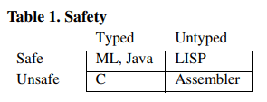

## 语言应该是安全的吗？

有些语言，例如 `C`，出于性能的考量被故意的（deliberately）设计的不安全，实现安全所需的运行时检查有时被认为太昂贵。即使在做大量静态分析的语言中，安全也是有代价的：一般来说，数组边界检查等测试不能在编译时完全消除。但仍有许多人努力设计 `C` 的安全子集，并制作开发工具，试图通过引入各种（相对昂贵的）运行时检查来安全执行 `C` 程序。
这些努力的原因主要有两个：C语言在那些基本上没有对性能要求的应用中的广泛使用，以及不安全的C程序引入的安全问题。安全问题包括由指针运算或缺乏数组边界检查引起的缓冲区溢出和欠溢，这些问题可能导致覆盖内存的任意区域，并可能被利用进行攻击。

安全性根据不同的衡量标准，比单纯的性能更具成本效益。安全性在执行错误时产生故障即停止行为，减少了调试时间。安全性保证了运行时结构的完整性，因此可以进行垃圾回收。反过来，垃圾回收又大大减少了代码大小和开发实践，代价是一些性能的牺牲。最后，安全性已经成为（emerged as）系统安全的必要基础，特别是对于加载和运行外来代码的系统（如操作系统内核和 Web 浏览器）来说。系统安全正在成为程序开发和维护中最昂贵的方面之一，而安全性可以降低这种成本。

因此，在安全语言和不安全语言之间的选择可能最终与开发和维护时间以及执行时间之间的权衡有关。虽然安全语言已经存在了几十年，但只是在最近才成为主流，首要的原因是安全问题。

## 语言是否应该被类型化？

编程语言是否应该有类型的问题仍然存在一些争论。毫无疑问，用非类型化语言编写的生产代码很难以维护。从可维护性的角度来看，即使是弱检查的不安全语言也优于安全但无类型的语言（如 `C`与 `LISP`）。以下是从工程角度提出的支持类型化语言的论点。

- 执行的经济性。类型信息最早在编程中引入的目的是，提高数值计算的代码生成和运行时间效率，例如在 `FORTRAN` 和 `ML` 中，准确的类型信息消除了对指针解引用的空检查的需要。一般来说，在编译时准确的类型信息会导致在运行时应用适当的操作，而不需要进行昂贵的测试。
- 小规模开发的经济性。当一个类型系统设计得很好时，类型检查可以捕捉到很大一部分（farction）常规（routing）编程错误，从而消除了冗长（lengthy）的调试环节。发生的错误更容易调试，只是因为已经排除了大类的其他错误。此外，有经验的程序员采用一种编码风格，使得一些逻辑错误显示为类型检查错误：他们将类型检查器作为开发工具。例如，当一个字段的不变量发生变化时，即使它的类型不变，也要改变它的名称，这样就可以得到它所有旧用途的错误报告。
- 编译的经济性。例如在 `Modula-2` 和 `Ada` 中，类型信息可以组织成程序模块的接口。然后，模块之间可以独立编译，每个模块只依赖于其他模块的接口。因为至少在接口稳定的情况下，一个模块的改变不会导致其他模块被重新编译，导致大型系统的编译效率更高。
- 大规模开发的经济性。接口和模块对于代码开发具有方法上的优势。大型程序员团队可以协商（negotiate）好要实现的接口，然后分别着手实现相应的代码片段。代码块之间的依赖性最小化，代码可以在局部重新排列，而不用担心全局影响。(这些好处也可以通过非形式化的接口规范来实现，但在实践中，类型检查对验证规范的遵守情况有很大的帮助。)
- 安全领域的开发和维护的经济性。安全是不仅是消除缓冲区溢出等安全漏洞的必要条件，也是消除其他灾难性（catastrophic）安全漏洞（breaches）的必要条件。这里有一个典型的例子：只有有一个方法，能够将一个整数转型成一个指针类型（或对象类型）的值，无论该方法是多么曲折（convoluted），那么整个系统就会受到损害（compromised）。如果这一点是可能的，那么攻击者就可以访问系统中任何地方的任何数据，甚至是在一个其他类型语言的范围内，根据附加选择的任何类型来查看数据。另一种有用的（但不是必须的）技术是将一个给定的类型指针转换成一个整数，然后再转换成一个不同类型的指针。如上所述，无论是在维护方面，也可能在整体执行效率方面，消除这些安全问题的最经济有效的方法，都是采用类型化语言。不过，安全问题在系统的各个层面都是一个问题：类型化语言是一个很好的基础，但不是一个完整的解决方案。
- 语言特征的经济性。类型构造自然是以正交的方式构成的。例如，在 `Pascal` 中，一个数组可以模拟二维数组；在 `ML` 中，一个具有单个参数的过程是 `n` 个参数的元组，可以模拟一个有 `n` 个参数的过程。因此，类型系统促进了语言特征的正交性，从而倾向于降低编程语言的复杂性。

## 类型系统的预期属性

在本章的其余部分，我们是在这样的假设下进行的：语言应该既安全又类型化，因此应该采用类型系统。在对类型系统的研究中，我们不区分有陷阱的错误和无陷阱的错误，也不区分安全和良好的行为：我们专注于良好的行为，我们把安全作为一种隐含的属性。

类型，正如编程语言中通常所希望的那样，具有实用性的特点，使它们与其他类型的程序注释不同。一般来说，关于程序行为的注释可以从非正式的注释到受定理证明的形式化规范。类型位于这个范围（spectrum）的中间：它们比程序注释更精确，比形式化规范更容易加工。以下是任何类型系统所期望的基本属性：

- 类型系统应该是可以决定性地验证（decidably verifiable）的：应该有一种算法（称为类型检查算法），可以确保程序的行为良好。类型系统的目的不是简单地陈述（state）程序员的意图（intentions），而是在执行错误发生之前主动捕捉执行错误。任意的形式化规范不具备这些特性）。
- 类型系统应该是透明的：程序员应该能够轻易地预测一个程序是否会进行类型检查。如果它没有进行类型检查，失败的原因应该是不言而喻（self-evident）的。（自动定理证明不具备这些特性）。
- 类型系统应是可执行（enforceable）的：类型声明应尽可能地进行静态检查，否则应进行动态检查。类型声明和它们相关的程序之间的一致性（consistency）应该得到常规的验证。(程序注释和惯例不具有这些属性。)

## 类型系统如何进行形式化

正如我们已经讨论过的，类型系统被用来定义好类型的概念，它本身就是良好行为（包括安全）的静态近似。安全性由于故障即停止行为而有利于调试，并通过保护运行时结构实现垃圾收集。良好类型通过在运行前捕获执行错误，进一步促进了程序开发。

但是，我们如何保证类型良好的程序真的是行为良好的呢？也就是说，我们如何保证语言的类型规则不会意外地让行为不佳的程序通过？

形式化类型系统是程序规范中描述的非正式类型系统的数学符号化。一旦一个类型系统被形式化，我们就可以尝试证明一个类型合理性定理，说明类型良好的程序表现良好。如果这样的健全性定理成立，我们就说类型系统是健全的。（一个类型化语言的所有程序的良好行为和它的类型系统的健全性是同一个意思）。

为了将类型系统形式化，并证明健全性定理，我们必须在本质上将整个有关语言形式化，正如我们现在所勾画的那样。

形式化编程语言的第一步是描述其语法。对于大多数感兴趣的语言来说，这可以简化为描述类型和项的语法。类型表达的是关于程序的静态知识，项（语句、表达式和其他程序片段）表达的是算法行为。
 
 下一步是定义语言的范围规则，它明确地将标识符的出现与它们的绑定位置（标识符被声明的位置）联系起来。类型化语言所需要的范围定义总是静态的，也就是说，标识符的绑定位置必须在运行前确定。绑定位置通常可以纯粹从语言的语法中确定，而不需要任何进一步的分析；静态范围定义就被称为词法范围定义。缺乏静态范围的称为动态范围。
 
 可以通过定义程序片段的自由变量集来正式指定作用域（这涉及到如何通过声明来指定变量的约束）。然后就可以定义相关的类型或项替代（subtitution）自由变量的概念。
 
 这一切都解决后，我们可以继续定义语言的类型规则。有些语言还要求在类型之间有一个 `A<:B` 的子类型的关系，并且经常有一个 `A=B` 的类型等价的关系。一种语言的类型规则的集合形成了它的类型系统。具有类型系统的语言称为类型语言。
 
 如果不首先引入另一个在语言语法中没有体现的基本要素：静态类型环境，类型规则就无法形式化。这些环境在处理程序片段的过程中用来记录自由变量的类型；它们与编译器在类型检查阶段的符号表紧密对应。类型规则总是针对被类型检查的片段的静态环境来制定。例如，$has-type$ 关系$M:A$ 与静态类型环境 $\Gamma$ 相关联，该环境中包含了 $M$ 和 $A$ 的自由变量的信息，该关系全文写为 $Γ \vdash M:A$，意思是 $M$ 在环境 $\Gamma$ 中具有类型 $A$。
 
 形式化语言的最后一步是将其语义定义为项和结果集合之间的 `has-value` 关系。这种关系的形式在很大程度上取决于所采用的语义学风格。在任何情况下，语言的语义和类型系统都是相互关联的：项的类型和其结果的类型应该是相同的（或适当相关的）；这就是健全性定理的本质。
 
 类型系统的基本概念几乎（virtual）适用于所有的计算范式（paradigms）（函数式、命令式、并发式等）。对于不同的范式，个别类型规则往往可以不加改变地采用。例如，无论语义是按名调用还是按值调用，或者是正交的函数式或命令式，函数的基本类型规则都是相同的。
 
 在本章中，我们独立于语义来讨论类型系统。但应该理解，最终类型系统必须与语义相关，而且对于该语义来说，健全性应该是成立的。可以这么（Suffice it to say ），结构操作语义学的技术统一处理了大量的编程范式集合，并且与本章中发现的处理方法非常吻合。
 
 ## 类型等同性
 
 如上所述，大多数非平凡类型系统都需要定义一个关于类型等价的关系等价类型。这是在定义编程语言时的一个重要问题：什么时候分开写的类型表达式是等价的？例如，考虑两个不同的类型名称，它们已经与相似的类型相关联。
 
 $$
 \begin{aligned}
 type X = Bool \\
 type Y = Bool
 \end{aligned}
 $$
 
 如果类型名 `X` 和 `Y` 因与类似类型相关联而匹配（match by virtue），我们就有结构等价性（structural equivalence）。如果它们由于是不同的类型名（不看关联类型）而不匹配，我们就有按名等价（by-name equivalence）。

在实践中，大多数语言都使用结构等价和按名等价的混合方式。纯粹的结构等价性可以通过类型规则轻松而精确地定义，而按名等价性则更难确定（pin down），而且通常具有算法的味道。当类型数据必须通过网络存储或传输时，结构等价性具有独特的优势；相比之下，按名等价性不能轻易处理在时间或空间上分别开发和编译的交互程序。

我们在下面的内容中假定结构等同（尽管这个问题并不经常出现）。正如 `Modula-3` 机制所证明的那样，结构等价可以获得令人满意的按名称等价的模拟。

# 2. 类型系统的语言
类型系统规定了（specify）程序语言的类型规则，独立于特定的类型检查算法。这类似于（analogous）用形式化语法来描述程序语言的语法，独立于特定的解析算法。 

将类型系统与类型检查算法脱钩（decouple）既方便又有用：类型系统属于语言定义，而算法属于编译器。用类型系统来解释语言的类型方面，比用某个编译器使用的算法更容易。此外，不同的编译器可能对同一类型系统使用不同的类型检查算法。

作为一个小（minor）问题，定义一个只接受（admit）不可行类型检查算法的、甚至是完全不接受类型检查算法的类型系统，在技术上是可行的。然而，通常的意图（intent）是允许有效的类型检查算法。

## 判别

类型系统使用特殊的形式来描述，我们现在来介绍一下。类型系统的描述始于对一个形式化语句（utterances）集合的描述，它称之为判别（judgements）。一个典型的判别有以下形式： 

$$
\begin{aligned}
\Gamma \vdash ℑ && \text{ℑ 是一种断言，自由变量 ℑ 在 \( \Gamma \)  中声明}
\end{aligned}
$$

我们说 $\Gamma$ 包含了 $ℑ$ 。这里 $\Gamma$ 是一个静态类型环境，例如，一个有序的不同变量和类型的列表，其形式为 $\phi, x_1 : A_1, ..., x_n: A_n$ 。空环境用记号 $\phi$ 表示， $\Gamma$ 中声明的变量集合用 $x_1, ..., x_n$ 用  $dom(\Gamma)$ 表示（indicated）。断言 $ℑ$ 的形式因判断而异（varies from judgement to judgement），但是所有的自由变量 $ℑ$ 必须在 $\Gamma$ 中被声明。

对我们目前的目的而言，最重要的判别是类型判别。它断言一个项 $M$ 对于（with respect to）$M$ 的静态类型环境具有类型 $A$，它有以下形式：

$$
\begin{aligned}
\Gamma \vdash M : A && \text{M 在 \( \Gamma \) 中有类型 A }
\end{aligned}
$$

案例：

$$
\begin{aligned}
\phi &\vdash true: Bool && \text{ true  有类型 Bool} \\
\phi,x:Nat &\vdash x+1:Nat && \text{ x 有类型 Nat，导出 x+1 也有类型 Nat }
\end{aligned}
$$

其它的判断形式往往是有有必要的；一种常见的是简单地断言环境是规整的（well-formed）：

$$
\begin{aligned}
\Gamma \vdash ◇ && \text{\(\Gamma\)是规整的（例如，他是被合理的构造的）}
\end {aligned}
$$

任何给定的判断都可以被视为有效的（例如 $\Gamma \vdash true: Bool$）或无效的（例如 $\Gamma \vdash true: Nat$）。有效性将类型良好的程序的概念（notion）形式化了。有效判断和无效判断之间的区别可以用多种方式表达，然而，已经出现了一种高度风格化的有效判断集的表达方式。这种以类型规则为基础的表达方式，有利于陈述（state）和证明（facilitate）关于类型系统的技术性的定理（theorem）和引理（lemma）。此外，类型规则是高度模块化的：不同构造的规则可以分别编写（与单一（mononithic）的类型检查算法相反（in contrast to））。因此，类型规则比较容易阅读和理解。

## 类型规则

类型规则在已经知道有效的其他判断的基础上，断言某些判断的有效性。这个过程通过一些内在（intrinsically）有效的判断（通常是 $\phi \vdash ◇$ ，说明空的环境是规整的）而得到出发点。 

$$
\begin{aligned}
\frac{\overset{（规则名）（标注）}{\Gamma_1 \vdash ℑ_1 \ ...\ \Gamma_n \vdash ℑ_n （标注）}}{\Gamma \vdash ℑ} && \quad \text{普遍的类型规则的形式}
\end{aligned}
$$

每条类型规则都写成一条横线上若干前提（premise）判断 $\Gamma_i \vdash ℑ_i$ ，横线下方有一个结论判断 $\Gamma \vdash ℑ$ 。当所有前提都满足时，结论一定成立，前提数可以为零。每个规则都有一个名字。(按照惯例，名称的第一个字由结论判断决定，例如，"(Val......)"形式的规则名称是针对结论是值型判断的规则而言的)。必要时，限制规则适用性的条件、以及规则内使用的缩写，都会在规则名称或前提旁边进行注释。

例如，下面两个规则中的第一个规则指出，在任何良好的形式环境Γ中，任何数字都是类型为 $Nat$ 的表达式。第二条规则指出，表示自然数的两个表达式 $M$ 和 $N$ 可以组合成一个更大的表达式 $M+N$ ，它也表示一个 $Nat$。此外，$M$ 和 $N$ 的环境 $\Gamma$，即声明 $M$ 和 $N$ 的任何自由变量的类型，也可以带到 $M+N$ 中。

$$
\frac{\overset{(Val n)\quad(n = 0, 1, ...)}{\Gamma \vdash ◇}}{\Gamma \vdash n: Nat} \qquad \frac{\overset{(Val+)}{\Gamma \vdash M: Nat}\quad \Gamma \vdash N: Nat}{\Gamma \vdash M+N: Nat}
$$

一个基本的规则声称空环境是规整的，没有假设。

$$
\frac{\overset{(Env \phi)}{\quad}}{\phi \vdash ◇}
$$

类型规则的合集被称为（形式化的）类型系统。从技术上讲，类型系统适合于形式化证明系统的一般框架：用于进行逐步演绎（deduction）的规则集合。类型系统中进行的推理涉及程序的类型化。

## 类型推导

在给定的类型系统中，一个推导是一棵判别树，叶在上面，根在下面，每个判别都是通过系统的一些规则从紧靠（immediately）上面的判断中得到（obtained）的。对类型系统的一个基本要求是，必须能够检查一个派生是否被正确构造。

有效的判断是指在给定的类型系统中，作为派生的根，可以得到的判断。也就是说，一个有效的判断是通过正确应用类型规则可以得到的判断。例如，使用前面给出的三条规则，我们可以建立下面的推导，从而确定 $\phi \vdash 1+2$  是一个有效的判别。每一步所应用的规则都显示在每个结论的右边。

$$
\frac{\frac{\phi\ \vdash\ ◇ \ (Env\ \phi)}{\phi\ \vdash\ 1: Nat\ (Val\ n)}\qquad\frac{\phi\ \vdash\ ◇\ (Env \phi)}{\phi\  \vdash\ 2: Nat\ (Val\ n)}}{\phi\ \vdash\ 1+2 : Nat\ (Val\ +)}
$$

## 好的类型和类型推断

在一个给定的类型系统中，如果存在一个类型 $A$，使得 $\Gamma \vdash M:A$ 是一个有效的判别；也就是说，如果项 $M$ 可以被赋予一些类型，那么对于一个环境 $\Gamma$ 来说，项 $M$ 就是良类型。

发现一个项的推导（一个类型）被称为类型推断问题。在含有规则 $(Env\ \phi)$，$(Val\ n)$ 和 $(Val\ +)$ 的简单类型系统中，一个类型可在空环境中由项 $1+2$ 推断出来。通过前面（preceding）的推导，这个类型即 $Nat$。

假设我们现在给前提 $\Gamma\ \vdash\ ◇$ 和结论 $\Gamma\ \vdash\ true:Bool$ 添加一条类型规则。在由此产生的类型系统中我们不能够为 $1 + true$ 推导出任何类型，因为不存在一个自然数与布尔数相加的规则。由于 $1 + true$ 不可推导，我们说它是不可类型化的，或者说它是类型不良的，或者称之为有类型错误。

进一步地，我们可以添加一个有前提（premises）$\Gamma\ \vdash\ M:Nat$ 和 $\Gamma\ \vdash\ N:Bool$ ，结论 $\Gamma\ \vdash\ M+N: Nat$ 的类型规则（其中，意图将 $true$ 解释为 $1$）。在这样一个类型系统中，项 $1 + true$ 的类型可以被推断出来，因此它是类型良好的。

因此，给定项的类型推断问题对有关（in question）类型系统是非常敏感的。根据类型系统，其类型推断算法可能非常容易，可能非常困难，也可能根本没法找到。即使找到，最好的算法可能非常有效，也可能慢的无可救药（hopelessly）。虽然类型系统是以抽象的方式来表达和设计的，但它们的实际效用（utility）取决于是否有好的类型推理算法。

对于显式类型化过程式语言（如 `Pascal` ）的类型推理问题是相当容易解决的；我们在第 8 节中处理（treat）这个问题。隐式类型语言（如ML）的类型推理问题要微妙得多，我们不在这里讨论它。基本算法是很好理解的（文章中出现了几种对它的描述），并且被广泛使用。然而，算法在实际中使用的版本很复杂，仍在研究（investigated）中。

在存在多态性的情况下，类型推理问题变得特别困难（在第5节中讨论）。`Ada`、`CLU` 和 `Standard ML` 的显式类型多态性特征的类型推理问题在实践中是可以处理的。然而，这些问题通常是由算法解决的，而没有首先描述相关的类型系统。最纯粹和最通用的多态性类型系统是由第5节中讨论的λ算子所体现（embodied）的。这个多态的λ-算子的类型推理算法相当简单，我们在第8节中介绍。然而，解决方案的简单性取决于不切实际的啰嗦的类型注释。为了使这种一般的多义性实用，必须省略一些类型信息。这种类型推理问题仍然是一个积极研究的领域。

## 类型健全性

我们现在已经建立了所有关于类型系统的一般概念（notions），我们可以开始研究特定的类型系统。从第3节开始，我们回顾一些非常强大但相当理论化的类型系统。我们的想法是，通过首先了解这几个系统，就能更容易地编写出编程语言中可能遇到的各种复杂功能的类型规则。

当我们沉浸在（immersing ourselves in）类型规则中时，我们应该记住，一个合理的类型系统不仅仅是一个任意的规则集合。合理的类型是为了对应一种良好的程序行为的语义概念。习惯上（it is customary to），通过证明类型健全性定理来检查类型系统的内部一致性。这就是类型系统与语义学的结合点。对于表征（denotational）语义，我们期望：如果 $\phi\ \vdash\ M: A$ 有效，那么 $\llbracket M\rrbracket \in \llbracket A \rrbracket$ 成立（$M$ 的值术语类型 $A$ 所表示的值集），对于操作语义，我们期望如果有 $\phi\ \vdash\ M: A$ 和 $M$ 可以规约出 $M'$ 的情况下，有 $\phi\ \vdash\ M': A$ 。在这两种情况下，类型健全性定理都断言，良好类型化的程序能够在没有执行错误的情况下进行计算。参见 [11, 34] 关于技术的调查，以及最先进的健全性证明。

# 3. 一阶类型系统

在大多数过程式语言中能够找到的类型系统称为一阶（first order）。在类型理论的行话（jargon）中，这意味着缺乏类型参数化（type parameterization）和类型抽象（type abstraction），它们是二阶类型系统的特性。`Pascal` 和 `Algol68` 拥有丰富的一阶类型系统，而 `FORTRAN` 和 `Algol60` 的一阶类型系统非常差。

对于一个非类型化的 λ运算可以给出一个最小化的一阶类型系统，其中非类型化的 λ 抽象 $\lambda x.M$ 表示一个拥有参数 $x$ 和结果 $M$ 的函数。类型化这种算子只需要函数类型和一些基本类型。我们将会在稍后看到如何添加一些常用的类型结构。

一阶类型化的 λ运算被称为 $F_1$。其主要变化是为非类型化的λ运算添加了λ抽象的类型标注（annotations），使用的语法是 $\lambda x:A.M$，其中 $x$ 是函数形参，$A$ 是它的类型，$M$ 是函数体（在类型化的编程语言中我们常常会包括结果的类型，但是这里没有必要）。从 $\lambda x.M$ 到 $\lambda x:A.M$ 的步骤是典型的从非类型化语言到需要类型标注的类型化语言的任何进展。

因为（since）$F_1$ 主要基于函数值，最有趣的类型是函数类型： $A \rightarrow B$ 是参数类型为 $A$、结果类型为 $B$ 的函数类型。为了开始，我们还需要一些基础类型来构造函数类型。我们用 $Basic$ 表示这种类型的一个集合，用 $K \in Basic$ 表示任何这种类型。基本类型纯粹是一种技术上的需要，但很快我们将考虑一些有趣的基本类型，如 $Bool$ 和 $Nat$。

$F_1$ 的语法在表 2 中给出。有必要简单评论以下语法在类型化语言中的作用。在非类型化的 λ运算中，上下文无关的文法正好（exactly）可以表述合法的程序。在类型化计算中，情况并非如此，因为良好的行为（通常）不是上下文无关属性的。描述合法程序的任务由类型系统来承担。例如，$\lambda x:K.x(y)$ 遵守表 2 中 $F_1$ 的文法， 但是它不是出于程序需要的，因为它是类型不良的，$K$ 不是函数类型。上下文无关文法仍然是需要的，但只为了定义自由变量和约束变量的概念，也就是语言定义的范围规则。基于范围规则，仅在它们约束变量上不同的项，诸如 $\lambda x:K.x$ 和 $\lambda y:K.y$，被认为在文法上是相同的。这种方便的识别在类型规则中被隐含的假定（assume）了（为了应用某些类型规则，人们可能不得不重命名约束变量）。

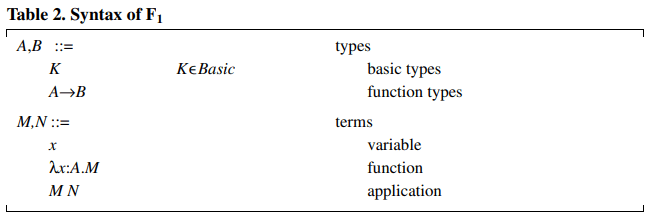

$F_1$ 的自由变量的定义和非类型化的 λ运算相同，只是后者忽略了类型化标注。

我们对 $F_1$ 只有三个简单的判别，如表 3 所示。$\Gamma\ \vdash\ A$ 判别在某种意义上（in a sense）是多余的，因为在环境 $\Gamma$ 中所有语法上正确的类型 $A$ 都会正确的形式化。然而，在二阶系统中，良好形式化的类型不是仅靠文法就能捕捉到的，该判别 $\Gamma\ \vdash\ A$ 就显得至关重要。现在采用（adopt）这个判别是很方便的，以后拓展它也会变得很方便。

这些判断的有效性由表4中的规则定义。规则 $(Env\ \phi)$ 是唯一不需要假设的规则（也就是说它是唯一的公理（axiom））。它说明空环境是一个有效的环境。规则 $(Env\ x)$ 用于将一个环境 $\Gamma$ 拓展到更长的环境 $\Gamma,x:A$ ，前提是 $A$ 是 $\Gamma$ 中有效的类型。注意，假设 $\Gamma\ \vdash A$ 意味着，归纳地（inductively） $\Gamma$ 是有效的。也就是说，在推导 $\Gamma\ \vdash\ A$ 的过程中，必须推导出 $\Gamma\ \vdash\ ◇$ 是有效的。这个规则的另一个要求是，$x$ 不能在 $\Gamma$ 中定义。我们小心翼翼地保持变量在环境中的不同，所以当 $\Gamma, x: A\ \vdash\ M:B$ 被导出时，就像 $(Val\ Fun)$ 的假设一样，我们知道 $x$ 不能出现在 $dom(\Gamma)$ 中。

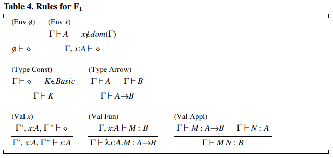

规则 $(Type\ Const)$ 和 $(Type\ Arrow)$ 构造类型。规则 $(Val\ x)$ 从环境中提取一个假设：我们使用记号 $\Gamma^{'},x:A,\Gamma^{''}$，而不是非形式化地表示 $x:A$ 出现在环境的某个地方。规则 $(Val\ Fun)$ 将类型 $A \rightarrow B$ 赋予一个函数，前提是函数体在形参具有类型 $A$ 的假设下接受类型 $B$，注意这个规则中环境是如何改变长度的。规则 $(Val\ Appl)$ 将一个函数应用于一个实参：在验证前提时，相同的类型 $A$ 必须出现两次。

表 5 显示了一个相当庞大的推导，其中使用了 $F_1$ 的所有规则。

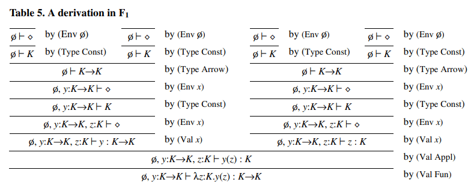

现在我们已经研究（examined）一个简单的一阶类型系统的基本结构，我们可以开始丰富它，使得它更加接近实际编程语言的类型结构。我们将为每一个新的类型构造添加一套规则，遵循一个相当有规律的模式。先从一些基本的数据类型开始：$Unit$ 类型，其唯一的值是常数单位；$Bool$ 类型，其值是 $true$ 和 $false$；$Nat$ 类型，其值是自然数。

$Unit$ 类型经常被用来做某些无趣实参和结果的填充物，它在某些语言中被称为 $Null$ 或者 $Void$。对 $Unit$ 没有任务和操作，所以只需要一条规则说明 $Unit$ 是合法类型，一条规则说明 $unit$ 是 $Unit$ 类型的合法值（表 6）。

我们对 $Bool$ 也有类似的规则模式，但是 $Bool$ 也有一个很有用的操作，即条件，它有自己的类型规则（表 7）。在规则 $(Val\ Cond)$ 中，条件的两个分支必须具有相同的类型 $A$，因为任何一个都可能产生结果。

这个规则 $(Val\ Cond)$ 说明了（illustrates）一个关于类型检查所需信息的微妙问题。当遇到一个条件表达式时，类型检查器必须分别推断 $N_1$ 和 $N_2$ 的类型，然后找到一个和两者兼容的单一类型 $A$。在某些类型系统中，从 $N_1$ 和 $N_2$ 的类型中确定这个单一类型可能并不容易，甚至并不可能。为了考虑到这种潜在的类型检查困难，我们使用下标（subscripted）类型来表达额外的类型信息，$if_A$ 是对类型检查器的一个提示，即结果类型应该是 $A$，并且 $N_1$ 和 $N_2$ 的推断类型应该分别与给定的 $A$ 进行比较。一般来说，我们使用下标（subscripted）来表示对类型检查可能有用或者必要的信息。当可以做到这一点时，下标可以省略。（大多数常用的语言不需要注解 $if_A$）

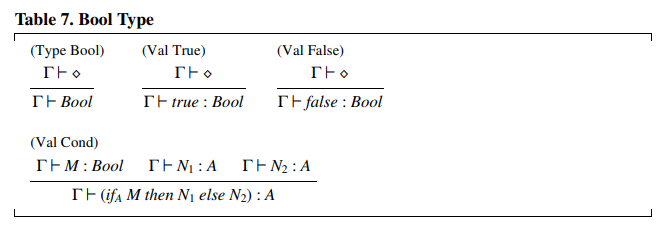

自然数的类型 $Nat$ （表 8），有 $0$ 和 $succ$（后继）作为生成器。另外（alternatively），像我们前面所做的那样，一条规则可以说明所有的数字常数都具有 $Nat$ 类型。通过 $pred$（前驱）和 $isZero$（测试零）基元可以实现对 $Nat$ 的计算；还可以选择其它基元集。

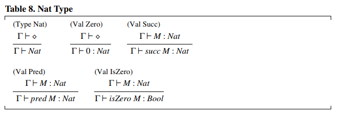

现在我们已经有了基本类型的集合，我们可以开始研究结构化类型，首先是乘积类型（product）（表 9）。产品类型 $A_1 \times A_2$ 是指第一分量类型是 $A_1$ 和第二分量类型是 $A_2$ 的二值序对的类型。这些分量分别可以使用投影 $first$ 和 $second$ 来提取。除了投影，可以使用 $with$ 语句去解构 $M$，并将其分量绑定到范围 $N$ 中的两个独立变量 $x_1$ 和 $x_2$ 上。$with$ 符合和 `ML` 的模式匹配有关，也和 `Pascal` 的 $with$ 有关；当我们考虑 $Record$ 类型时，与后者的联系将变得更加清晰。

乘积类型可以很容易地产生为元组类型 $A_1 \times ... \times A_n$ ，并且有相应的产生投影和产生 $with$。

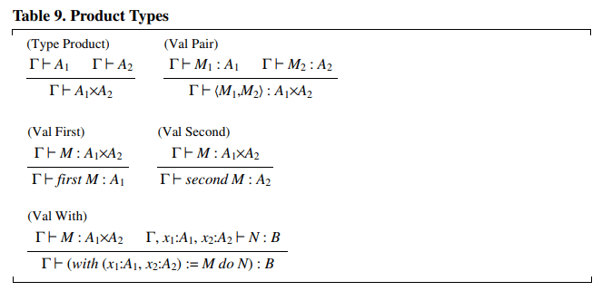

联合类型（Union Type）（表 10）经常被忽视（overlooked），但对于表达能力（expressiveness）来说，联合类型和乘积类型同样重要。一个联合类型 $A_1 + A_2$ 的元素可以被认为是一个 $A_1$ 类型元素，被标记为左标记（由 $inLeft$ 创建），或者一个 $A_2$ 类型的元素，其标记为右标记（由 $inRight$）。可以通过 $isLeft$ 和 $isRight$ 测试这些标记，并通过 $asLeft$ 和 $asRight$ 提取相应的值。如果 $asLeft$ 标记被错误地应用于右标记的值，就会产生一个陷阱错误或者异常。这个陷阱错误不被认为是禁止错误。请注意，可以安全的假设 $asLeft$ 的任何结果都具有 $A_1$ 类型，因为要么实参是左标记，这种情况下结果确实（indeed）是 $A_1$，或者实参是右标记，这种情况下不会有结果。下标（subscripts）是用来消除某些规则的歧义，正如我们在讨论条件时所讨论的那样。

规则 $(Val\ Case)$ 描述了一个优雅（elegant）的构造，它可以取代 $isLeft$、$isRight$、$asLeft$ 和 $asRight$ 以及相关的陷阱错误，它还消除了联合操作对 $Bool$ 类型的任何依赖。$case$ 构造根据 $M$ 的标记执行两条分支中的一个， $M$ 未标记的内容分别绑定到范围 $N_1$ 或 $N_2$ 中的 $x_1$ 或者 $x_2$ 。分支之间用竖线分割。

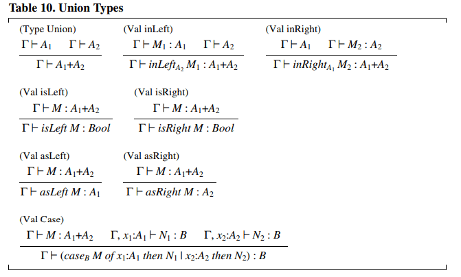

在表达性方面（in terms of）（而不是在实现方面），注意 $Bool$ 类型可以被定义为 $Unit + Unit$。在这种情况下，$case$ 可以约简为条件。$Int$ 类型可以被定义为 $Nat + Nat$，$Nat$ 的一个副本用于非负数，另一个用于负数。我们可以定义一个典型的（prototypical）陷阱错误 $error_A = asRight(inLeft_A(unit)): A$。因此，我们可以为每种类型构建一个错误表达式。

乘积类型和联合类型可以迭代产生元组类型和多联合（multiple unions）。然而，这些派生类型相当不方便，我们很少在语言中看到。取代地是标签乘积（labeled products）和联合体（unions）。它们分别以记录类型（record types）和变体类型（variant types）出现。

记录类型是常见的命名集合类型，拥有可以通过名字提取组件的值级别操作。表 11 假设记录类型的语法识别和对其标注的组分进行重排序。这类似（analogous）函数的语法识别以及对绑定变量的重命名。

规则 $(Val\ Record\ With)$ 中，将乘积类型的 $with$ 语句生成记录类型。记录 $M$ 中标有 $l_1, ..., l_n$ 的组分被绑定到范围 $N$ 的变量 $x_1,...,x_n$ 上。`Pascal` 有类似的结构，也叫作 $with$ ，但是变量的绑定是左向隐式的（这有一个相当不幸的后果，那就是使得作用于依赖于类型检查，并且由于隐式变量的冲突而导致难以追踪的错误）。

乘积类型 $A_1 \times A_2$ 可以定义为 $Record(first: A_1, second: A_2)$。

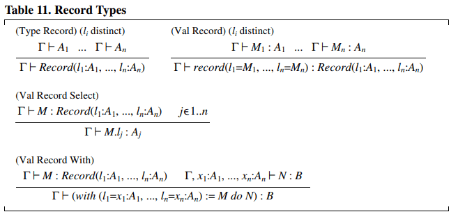

变体类型（表 12） 被命名为类型的不相干（disjoint）的联合体。它们在语法上被识别，直至组件的重新排序。$is\ l$ 构造产生了 $isLeft$ 和 $isRight$ ，$as\ l$ 构造产生了 $asLeft$ 和 $asRight$ 。与联合一样，这些类型可以被 $case$ 语句取代，现在会出现多个分支。

联合类型 $A_1 + A_2$ 可以被定义为 $Variant(left: A_1, right: A_2)$ 。枚举类型，诸如 ${red, green, blue}$ 可以被定义为 ${red: Unit, green: Unit, blue: Unit}$。

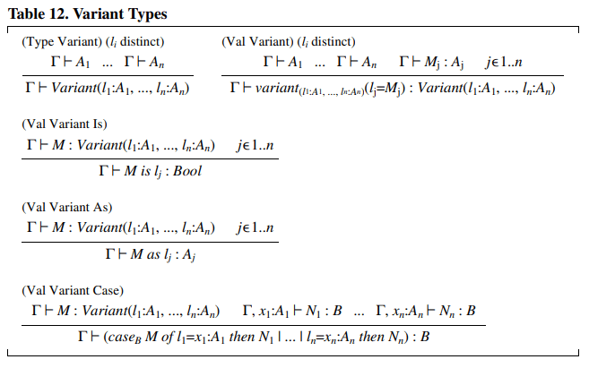

引用类型（Reference Types）（表 13）可以作为命令式语言可变位置的基本类型。一个 $Ref(A)$ 类型是一个包含类型 $A$ 元素的可变小室（cell）。一个新的小室可以通过 $(Val\ Ref)$ 申请，通过  $(Val\ Assign)$ 更新，以及通过 $(Val\ Deref)$ 去显式地解引用（dereferenced）。由于赋值的主要目的是执行副作用，所以其结果值选择为 $unit$。

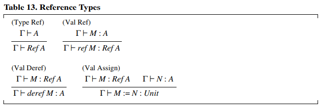

常见的可变类型可以从 $Ref$ 中派生出来。例如，可变记录类型，可以被记录为包含引用类型的记录类型。

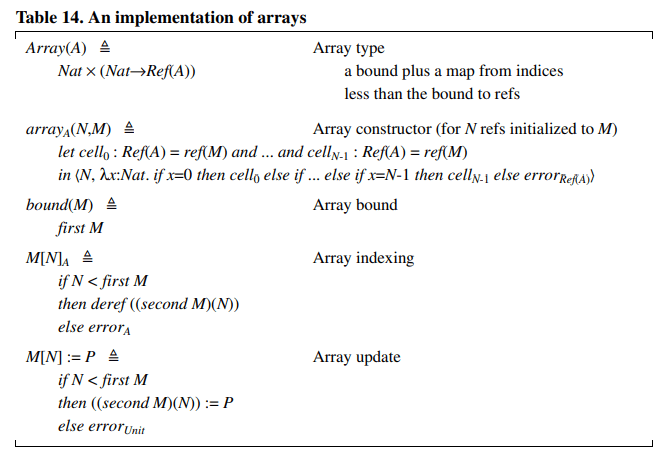

更有趣的是，数组和数组类型可以如表 14那样建模，其中 $Array(A)$ 是一定长度的 $A$ 类型元素的数组类型。（代码中使用了一些算术基元和局部 $let$ 声明。）表中的代码当然是对数组的低效实现，但是说明（illustrate）了一点：更复杂构造类型可以通过更简单的构造的类型规则中推导出来。根据乘积、函数和引用的规则额，表 15 中所示的数组操作的类型规则还可以很容易地从表 14 中导出。

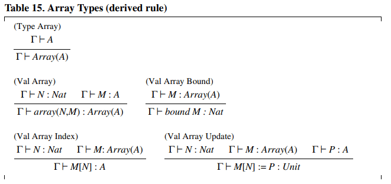

在大多数编程语言中，类型能够被递归地定义。递归的类型是很重要的，因为他们使得所有其它类型更加有用。它们常常被隐式地引入，而且没有精确的解释，它们的特性也是相当（rather）微妙的。因此，它们的形式化值得特别注意。

对递归类型的处理需要对 $F_1$ 做一个额外的处理：环境可以被拓展到包含类型变量 $X$，这些类型变量被用于形为$\mu X.A$ 的递归类型上（表 16）。它们直观地（intutitively）表示（denote）形为 $X=A$ 的递归方程的解，其中 $X$ 可能出现在 $A$ 中。操作 $unfold$ 和 $fold$ 是显式地强制（coercions）递归类型 $\mu X.A$ 和它的解折叠 $[\mu X.A/X]A$ （其中 $[B/X]A$ 是 $B$ 对 $A$ 中所有自由出现的 $X$ 的替换），反之亦然。这些强制没有任何运行时副作用（意味着 $unfold(fold(M))=M$ 和 $fold(unfold(M^{'}))=M^{'}$）。它们通常在实际编程语言的语法中被省略，但它们的存在使得形式化处理变得更加容易。

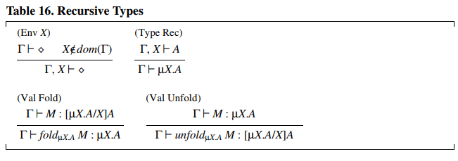

递归类型的一个标准应用是结合（conjunction）乘积类型和联合类型，定义列表和树。表 17 中定义了 $A$ 类型元素的列表 $List_A$ ，以及列表构造函数 $nil$ 和 $cons$，还有列表分析器 $listCase$。

递归类型可以和记录类型、变体类型一起使用，定义复杂的树结构，如抽象语法树。然后可以使用 $case$ 和 $with$ 语句来方便地分析这些树。

当与函数类型结合（conjunction）使用时，递归类型具有惊人的表现力。通过巧妙地编码，我们可以证明值级别的递归已经包含了隐含的递归类型，没有必要将递归引入作为一个单独的结构。此外，在递归类型的存在下，可以在类型化语言中进行非类型化编程。更准确地说，表 18 说明了如何为任何类型 $A$ 定义该类型的分叉元素 $\bot_A$ $Y_A$ ，以及该类型的 fixpoint 操作符 $Y_A$。表 19 说明了如何在类型化 λ 演算中对非类型化的 λ算子进行编码。（这些编码是针对按名调用的，它们在按值调用中的形式略有不同）。

在存在递归类型的情况下，类型等价性变得特别有趣。我们在此处避开了几个问题，不处理类型定义，要求递归类型和它的展开之间有明确的 $unfold$ 、$fold$ 强制，除了约束变量的重命名之外，不假设递归类型之间有任何标识。在当前的表述中，我们不需要为类型等价新定义一个形式化的判断：如果两个递归类型在结构上是相同的（直到重命名变量），那么它们就会被等价。这种简化的方法可以拓展到包括类型定义和类型等价，直到递归类型的展开 [2, 26]。

# 4. 命令式语言的一阶类型系统

命令式语言的类型系统风格略有不同，主要是他们将不产生值的命令和产生值的表达式区分开来（通过赋值命令类型 $Unit$ 来将命令简化为表达式是可能的，但是我们更愿意忠实于这种自然的区分）。

作为一个命令式语言的例子，我们考虑表 20 中总结的非类型命令式语言。这种语言允许我们声明的类型规则，我们到目前为止还没有考虑到这一点。在这种语言中，对过程和数据类型的处理时非常初级的，但第三节中描述的函数和数据的规则可以很容易地调整。命令式语言的特征的含义应该是不言而喻的。

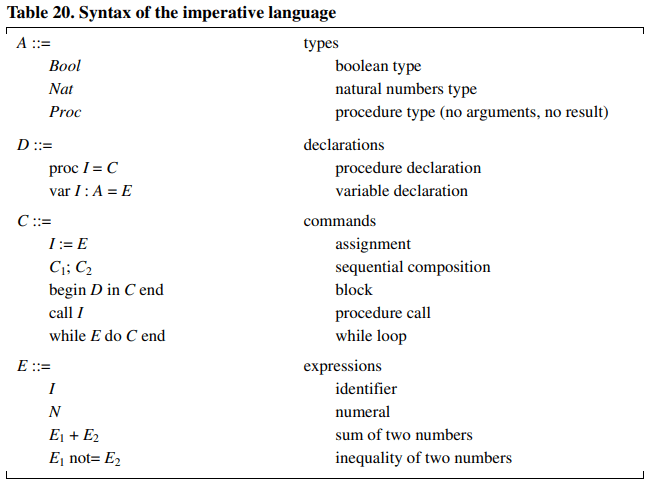

我们命令式语言的判别列举在表 21 中。判别 $\Gamma\ \vdash\ C$ 和 $\Gamma\ \vdash\ E:A$ 对应于（correspond to） $F_1$ 中的单个判别 $\Gamma\ \vdash\ M$ ，因为我们现在有了命令 $C$ 和表达式 $E$ 之间的区别。判别 $\Gamma\ \vdash\ D \therefore S$，将一个签名 $S$ 分配给一个声明 $D$；签名本质上是声明的类型。在这种简单的语言中，一个签名由一个单一的组件组成，例如 $x: Nat$ ，一个匹配的声明可以是 $var x: Nat = 3$ 。一般来说，签名将由这种组件的列表组成，并且看起来与环境 $\Gamma$ 非常相似或者相同。

表 22 列出了命令式语言的类型规则

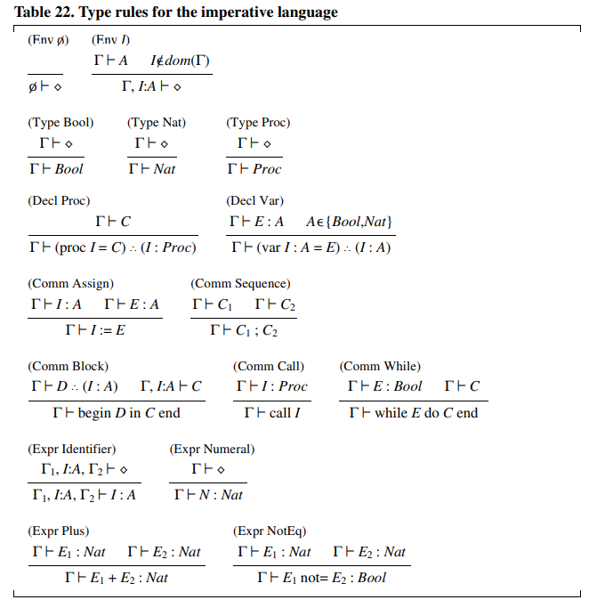

规则 $(Env\ ...)$，$(Type\ ...)$ 和 $(Expr\ ...)$ 使我们在 $F_1$ 中看到的规则的直接变体（variation）。规则 $(Decl\ ...)$ 处理声明的类型。规则 $(Comm\ ...)$处理命令；注意 $(Comm\ Block)$ 在检查块体时如何将签名转换为一块环境。

# 5. 二阶类型系统

许多现代化语言都包括类型参数、类型抽象或者两者兼而有之的构造。类型参数可以在一些语言的模块系统中找到，其中一个通用模块、类或接口被一个类型参数化，以便以后提供。`Java` 和 `C#` 扩展在类和接口级使用类型参数。（`C++` 的模板类似于类型参数，`bur` 其实是宏扩展的一种形式，属性很不一样)。多态语言如 `ML` 和 `Haskell` 更普遍地使用类型参数，在函数级。类型抽象可以与模块相结合，在接口中以不透明类型的形式出现，如 `Modula-2` 和 `Modula-3` 。`CLU` 等语言在数据级使用类型抽象，获得抽象的数据类型。这些高级功能可以用所谓的二阶类型系统来建模。

二阶类型系统使用一种类型参数的记号拓展了一阶类型系统。一种新的项，写作 $\lambda X.M$，标识对一个代表任意类型的变量 $X$ 进行参数化的程序 $M$。例如，一个固定类型 $A$ 的表示函数，写成 $\lambda x: A.x$，可以通过抽象在 $A$ 上写入 $id \overset{\triangle}{=} \lambda X.\lambda x: X.x$ 的方式，变成一个参数化的标识函数。然后，我们可以通过类型实例化，将这样一个参数函数实例化到任何给定的类型 $A$ 上，写成 $id\ A$，从而产生回 $\lambda x: A.x$。

对于新的项 $\lambda X.M$，我们需要新的普遍量化的类型（universally quantified types）。类似 $\lambda X.M$ 的一个项的类型些 $\forall X.A$，意味着对于所有 $X$，其体 $M$ 具有类型 $A$ （这里 $M$ 和 $A$ 可能包含 $X$ 的出现）。例如，$identity$ 的参数 $id: \forall X.X\rightarrow X$。因为对于所有的类型 $X$， 类型实例 $id X$ 具有类型 $X \rightarrow X$。

纯二阶系统 $F_2$ （表 23）完全基于变量类型、函数类型和量化类型。注意到我们放弃了基本类型 $K$。因为我们现在可以使用类型变量作为基本情况。事实证明，几乎所有感兴趣的基本类型都可以在 $F_2$ 中进行编码 [4]。同样，乘积类型、和类型、存在类型和一些递归类型，都可以在 $F_2$ 内编码。多态具有惊人的表达能力。因此，在技术上，几乎没有必要直接处理这些类型构造。

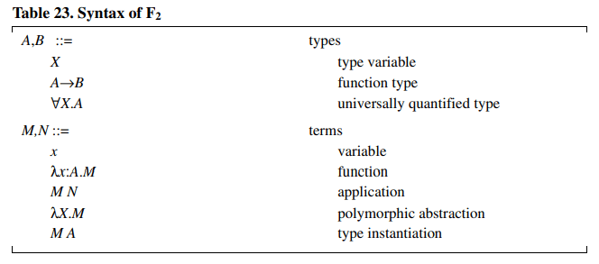

$F_2$ 的类型和项的自由变量可以用通常的方式（fashion）来定义：不妨说 $\forall X.A$ 在 $A$ 中绑定 $X$，$\lambda X.M$ 在 $M$ 中绑定 $X$ 即可。$F_2$ 的一个有趣的方面是在类型实例化的类型变量的替换。$(Val\ Appl2)$

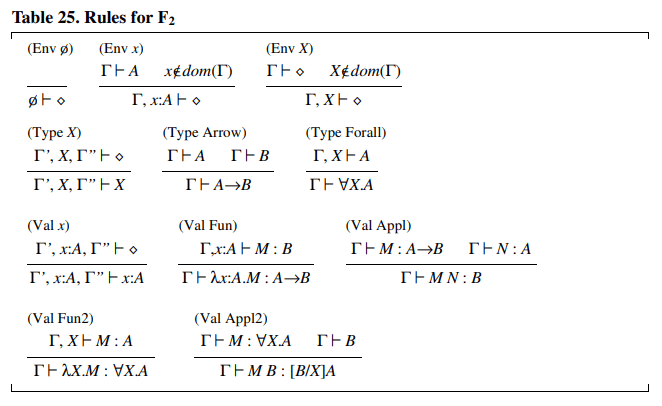

$F_2$ 的判别（表 24）与 $F_1$ 的相同，但是环境更加丰富。关于 $F_1$ ，新的规则（表 25），是 $(Env\ X)$：将类型变量添加到环境中；$(Type\ Forall)$，从变量 $X$ 和 $X$ 可能出现的类型 $A$ 中构造出一个量化的类型 $\forall X.A$; $(Val\ Fun2)$，建立一个多态抽象；以及 $(Val\ Appl2)$，将一个多态抽象实例化到给定的类型中，其中 $[B/X]A$ 是 $B$ 对 $A$ 中 $X$ 的所有自由出现的替换。例如，如果 $id$ 具有类型 $X.X \rightarrow X$，$A$ 是一个类型，那么由 $(Val\ Appl2)$ 我们可以得到 $id A$ 具有类型 $[A/X]{(X\rightarrow X)}\equiv A \rightarrow A $。作为一个简单但有指导意义的联系，读者不妨构建 $id(\forall X.X \rightarrow X)(id)$ 的推导。

作为 $F_2$ 的拓展，我们可以采用我们已经讨论过的 $F_1$ 的所有一阶结果。一个更有趣的拓展是存在量化类型（existentially quantified types），也称为类型抽象。

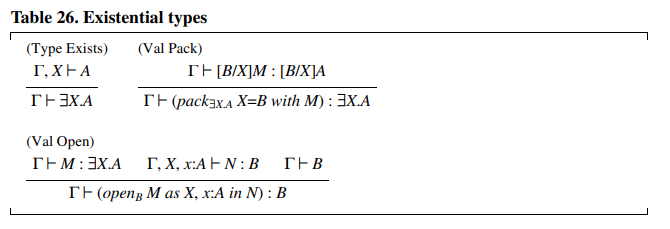

为了说明它的使用，我们考虑一个针对布尔的抽象类型。正如前文所述，布尔值可以表示为 $Unit + Unit$ 的类型。现在我们可以展示如何向一个不关心布尔如何实现，但希望利用 $true$、$false$ 和 $cond$ 的客户端隐藏这个表示细节。首先定义一个这样的接口供客户端使用：

$$
\begin{aligned}
BoolInterface\quad&\overset{\triangle}{=} \quad \exist Bool.Record(true:Bool, false: Bool, cond: \forall Y.Bool \rightarrow Y \rightarrow Y \rightarrow Y)
\end{aligned}
$$
这个接口声明了存在一个类型 $Bool$（不泄露其身份），它支持适当类型的 $true$、$false$ 和 $cond$ 操作。条件是以其结果类型 $Y$ 为参数的，它可能会根据使用环境而变化。

接下来我们定义这个接口的一个特殊实现：将 $Bool$ 表示为 $Unit + Unit$，并通过 $case$ 语句来实现条件。布尔表示类型和相关的布尔操作将由 $pack$ 构造打包在一起。

$$
\begin{aligned}
boolModule: BoolInterface\quad&\overset{\triangle}{\equiv} \\
pack_{BoolInterface} Bool &= Unit + Unit \\
with record(& \\
& true = inLeft(unit), \\
& false = inRIght(unit), \\
& cond = \lambda Y. \lambda x:Bool. \lambda y_1: Y. \lambda y_2: Y. \\
& case_y\ x\ of\ x_1: Unit\ then\ y_1 | x_2: Unit\ then\ y_2)
\end{aligned}
$$
最后，客户端可以通过打开它来使用这个模块，从而获得对布尔类型抽象名称 $Bool$ 的访问，以及对名为 $boolOp$ 的布尔操作的记录的访问。在下一个例子中，这些名字被用于一个返回自然数的简单计算。（下面的计算大体上是, $if\ boolOp.true\ then\ 1\ else\ 0.$）

$$
\begin{aligned}
&open_{Nat}\ boolModule\\
&as Bool, boolOp:Record(true: Bool, false: Bool, cond: \forall Y.Bool \rightarrow Y \rightarrow Y \rightarrow Y) \\
&in boolOp.cond(Nat)(boolOp.true)(1)(0)
\end{aligned}
$$

读者应该验证这些例子是否按照前面给出的规则进行类型检查，请注意 $(Val\ Open)$ 的关键的第三个假设，它意味着结果类型 $B$ 不能包含变量 $X$。该假设禁止将例如 $boolOp.true$ 写成前一个例子中的 $open$ 的主体，因为这样一来，结果类型将是变量 $Bool$。由于第三个假设，表示类型 $(Bool)$ 的抽象名称不能逃出 $open$ 的范围，因此具有该标识类型的值也不能逃出。这种限制是有必要的，否则标识类型可能会被客户知道。
